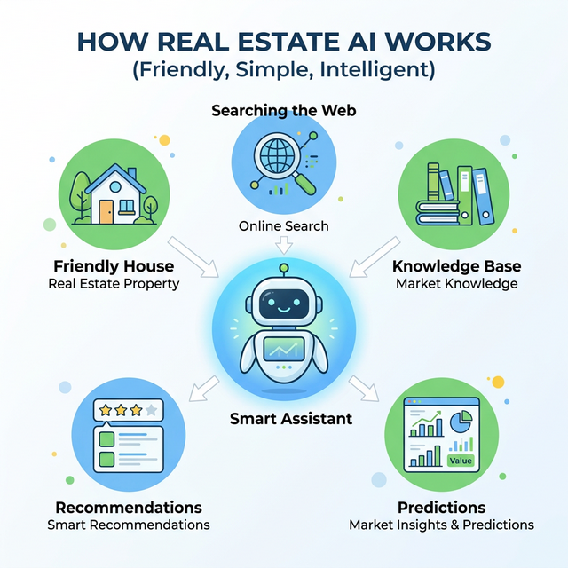
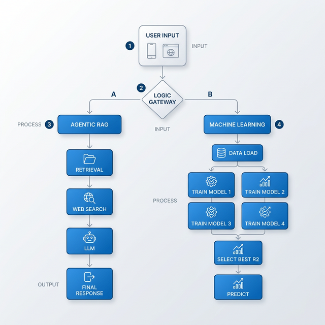

# 🏠 Nepal Real Estate Agentic RAG AI

A comprehensive real estate assistant for the Nepal market, combining multi-model Machine Learning for price prediction with a RAG-based Agentic AI for deep insights.

## 🚀 Key Features

- **💬 Agentic Chat**: Query local house datasets or search the live web for real estate regulations, taxes, and market trends.
- **📊 Optimized Price Predictor (ML)**: Automatically trains and evaluates **4 different models** (Random Forest, XGBoost, Decision Tree, Linear Regression) to select the most accurate engine for each prediction.
- **📈 Data Insights (EDA)**: Interactive visualizations showing price distributions, popular locations, and feature correlations with AI-driven market analysis.
- **🔍 Reasoning Transparency**: View the AI's step-by-step "Thought" process, explicitly indicating whether information came from the **Local Knowledge Base** or a **Real-time Web Search**.
- **🔄 Clear History**: Reset the conversation and agent memory with a single click in the sidebar.

## 🏗️ Project Architecture & Workflow

### 🚀 Simple Overview (For Everyone)
If you're new to AI, here's the simple version of how this assistant helps you find and value properties in Nepal:



#### ⚖️ Decision & Data Flow
Here is a technical flowchart detailing the internal logic and decision-making process:



## 🛠️ Tech Stack

- **UI**: Streamlit (Custom Premium Light Theme with Highlighted Navigation)
- **AI Framework**: LangChain (Re-Act Agent with Intermediate Reasoning)
- **Local LLM**: LM Studio (Compatible with OpenAI API)
- **Vector DB**: ChromaDB with native **`langchain-chroma`** integration and HuggingFace Embeddings
- **ML Engine**: Scikit-Learn & **XGBoost** (Automated Model Selection via R² Score)
- **Visualization**: Plotly & Pandas

## ⚙️ Setup & Installation

1. **Clone the repository** and navigate to the project folder.
2. **Setup Virtual Environment**:
   ```bash
   python -m venv venv
   source venv/bin/activate  # Mac/Linux
   pip install -r requirements.txt
   ```
3. **Configure LM Studio**:
   - Ensure LM Studio is running.
   - Load your preferred model (e.g., Llama 3 or Mistral).
   - Start the Local Inference Server (default: `http://localhost:1234`).
4. **Environment Variables**:
   - Check `src/config.py` to ensure the `LM_STUDIO_BASE_URL` matches your server.

---

## 🏃 Running the App

Start the Streamlit dashboard:
```bash
streamlit run app.py
```

## 📂 Project Structure

- `app.py`: Main Streamlit application and UI logic.
- `src/agent.py`: Agentic AI logic and tool configuration.
- `src/ml_model.py`: Multi-model training, evaluation, and selection.
- `src/eda_logic.py`: Data visualization and statistics generation.
- `src/vector_db.py`: Knowledge base indexing and retrieval (ChromaDB).
- `data/`: Local real estate CSV datasets.
- `chroma_data/`: Persistent vector store directory.
- `screenshots/`: App screenshot assets for UI documentation and demo visuals.

## 🖼️ Screenshots

All current application UI screenshots are stored in the `screenshots/` folder. These images can be used for quick visual validation of the dashboard, agent flow, and predictive analytics screens.

